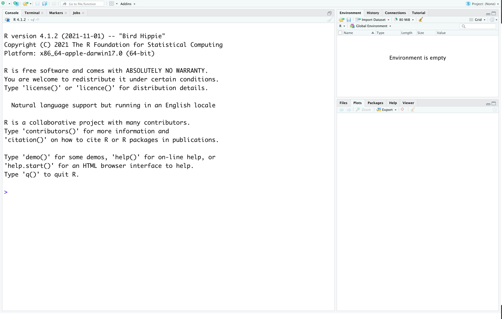
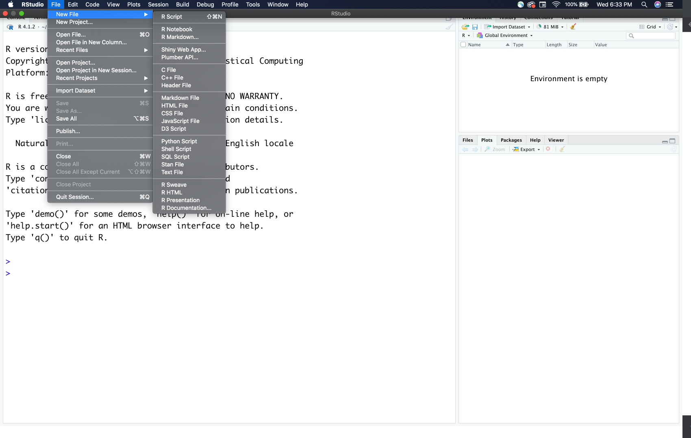
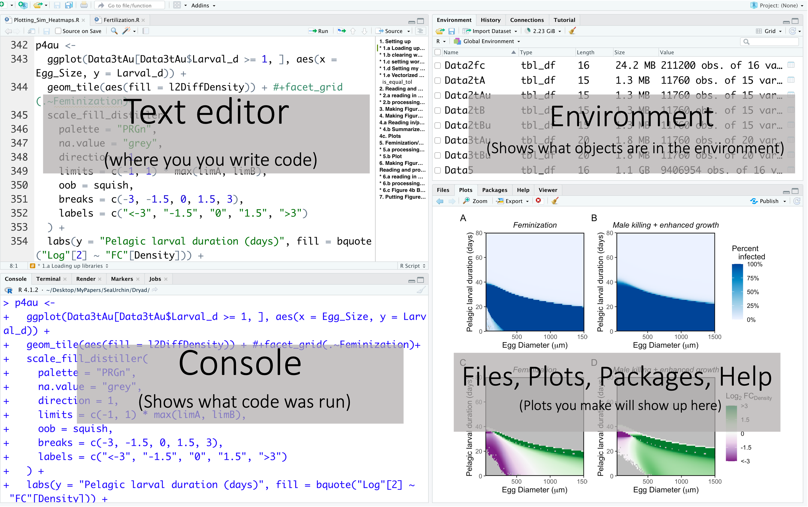
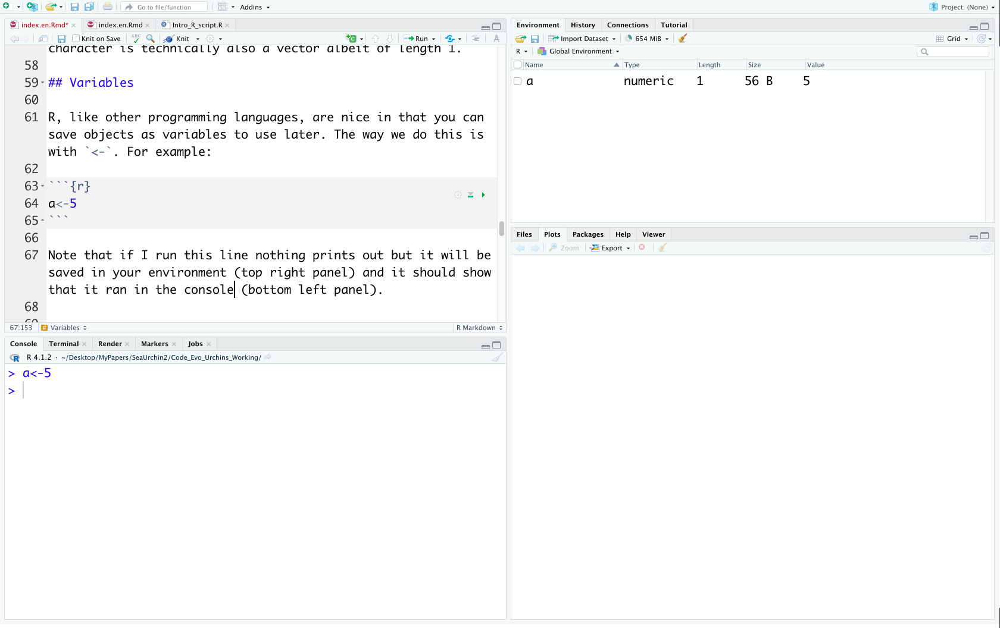
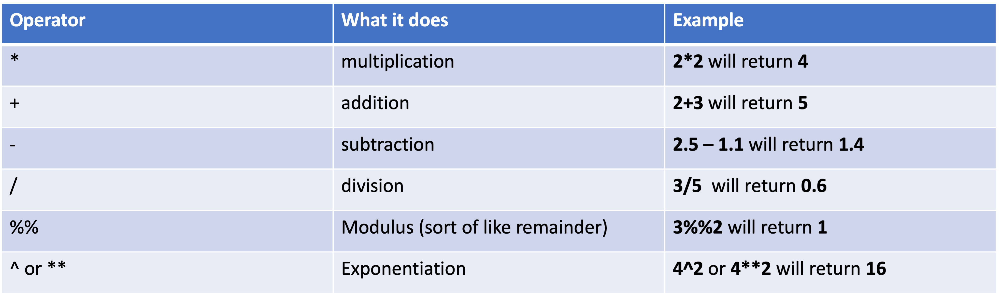
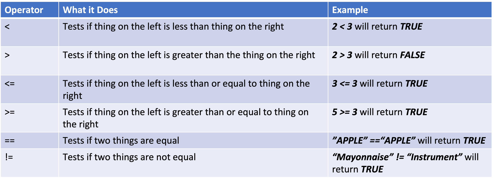
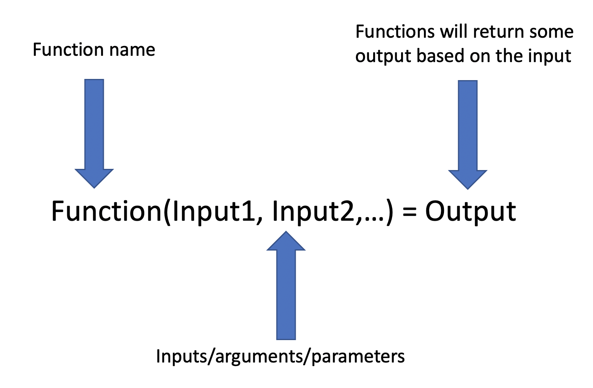
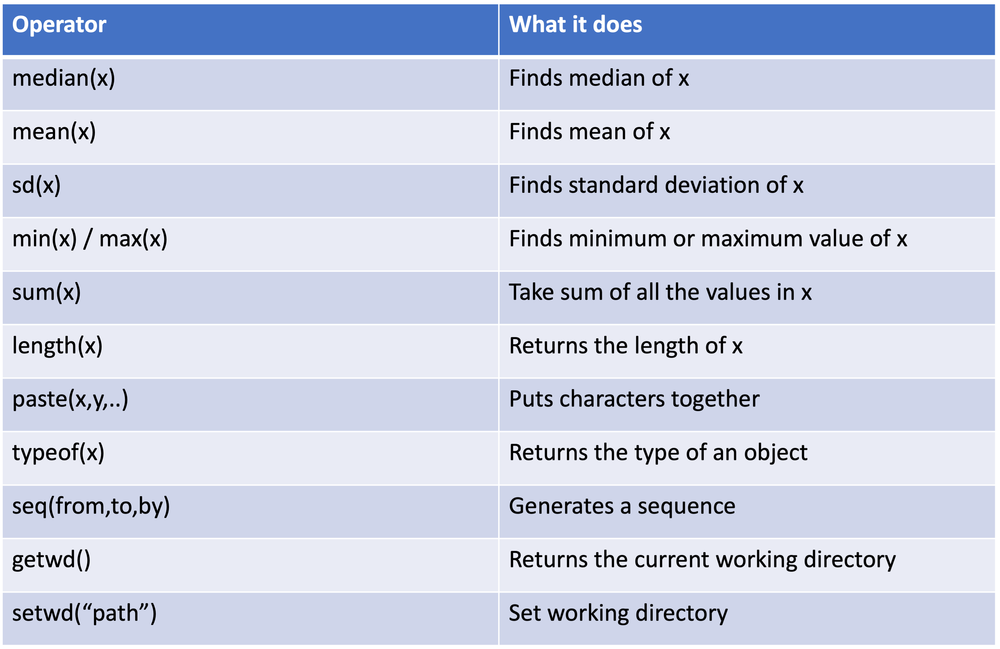
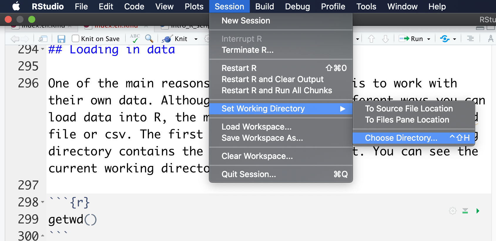
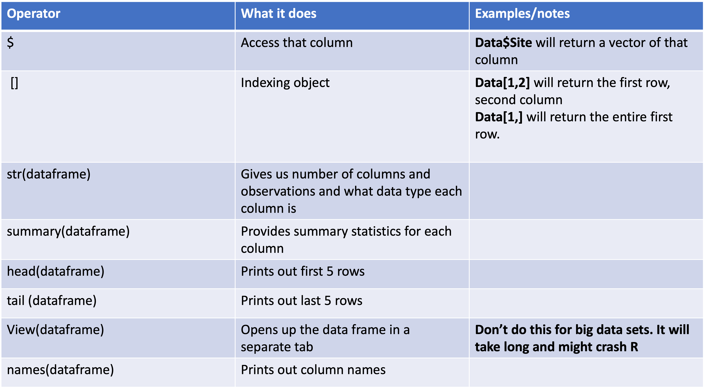

```{r setup, include=FALSE}
knitr::opts_chunk$set(echo = TRUE)
#install.packages("rmdformats")
library(rmdformats)
```

## Introduction to R and RStudio

This tutorial is designed as a short introduction into the R programming language and specifically using RStudio.

R is a free, open source programming language originally developed to analyze data, but it has been greatly expanded to do a lot of tasks. For example, I use R to make interactive websites via the Shiny package. 

RStudio is an IDE (integrative development environment). IDEs are useful because they let you edit/write code but provide a ton of helpful things for you that a plain text editor does not. For example, RStudio will start suggesting certain functions as you are typing and will let you know what inputs these functions require. It will allow you to visualize plots without having to save them. It integrates with other packages allowing me to just click on a few things to publish this tutorial. I built my whole website and other tutorials all within RStudio. These are just a few of the many handful features of RStudio.

## Installing R and R Studio

First install R from [here](https://ftp.osuosl.org/pub/cran/). Then install RStudio Desktop [here](https://www.rstudio.com/products/rstudio/download/). 


## RStudio

When you first open up R studio it should look something like this:


The console on the left should have information on the current version of R. If it doesn't then that means RStudio can't find the path to R or you don't have R installed. 

Let's open up a new R script file to see what RStudio will normally look like. To do that, go to "File -> New File -> R Script" like this:



If you noticed there are a few other R file options. Those are from other packages that developers have integrated into RStudio. For example, this tutorial was constructing using R Markdown, a file that lets you make reports that integrate regular text and R code all in one html or pdf file (not covered in this lesson). For most coding/analyses you will be using the standard R script.

To give a better sense of what an active enviornment looks like I'm going to open up a project I'm working on.



RStudio has four main windows. The top left is the text editor. That's where you will type the code that you want to save. Typing the code will not run it! To run the code you need to go to the line with your cursor or highlight the sections you want to run. Then if you are using a mac do "command + return" for Windows it's "Control + Enter."'

Code you have run will now appear on the bottom left in the console. You can also directly type code and run it here but it will NOT save when you save the script! `>` means R is ready for you to run code `+` means that R is still waiting for you to type something. To get out of that simply press escape. 

The top right panel is the environment. That's where you can see all the objects (which we will get into later) that are in your environment and you can use. Clicking on the objects will give you some more info, or for data frames will actually open them up in a separate window.

The bottom right panel is where your plots will appear. But if you noticed it also has tabs for "Files," "Packages," "Help," and "Viewer." "Files" show what files are in your current working directory (more on that later), "Packages" shows what packages you have installed and which are currently loaded up. Packages are essentially nicely packaged code that contains useful functions other R users have made that you can use for yourself. "Help" contains information on how to use various functions that are either included in base R or functions from packages you have installed. To get to that you can use the `?` followed by the function name like this: `?FunctionName`

## Types of values

In R, like other programming languages, objects can take on a few different of types. Here are a few commonly used ones. **double** objects also known as **numeric** represent any real number (e.g., `1.1`). There are also `integer` objects that are integers i.e., they don't contain decimal places, however, by default `1` will be interpreted as a **double**. We also have **logical** values which are either `TRUE` or `FALSE`. **character** can be thought of as text objects and are donated by using double quotations ( e.g,`"a"`).  

**Disclaimer/clarification**: Interestingly in R, all the above types are technically vectors. But please note that in this tutorial I use vector to mean anything with length greater than 1, even though in R a single number or single character is technically also a vector albeit of length 1.

## Variables

R, like other programming languages, are nice in that you can save objects as variables to use later. The way we do this is with `<-`. For example:

```{r}
a<-5
```

Note that if I run this line nothing prints out but it will be saved in your environment (top right panel) and it should show that it ran in the console (bottom left panel).



To actually print out the value there are a few ways. You can either just run the name of the variable `a`. You can use the function print, `print(a)`. Or you can put parentheses around the variable assignment `(a<-5)`. 

```{r}
a
print(a)
(a<-5)
```

## Commenting 

Now that we are starting to code it is probably important to talk about comments. A good practice when programming is to make notes. This will help keep you organized and will help others (including your future self) understand what your code is doing. In R to make a comment use `#`. Anything that occurs after `#` will not be evaluated. For example:

```{r}
#I'm assigning the variable a equal to 5 and printing it out
(a<-5)
```

## Numerical values

The simplest way that you can use R is as a calculator. Here is a table on the most commonly used mathematical operators:



We can use these operators on variables we defined. For example:

```{r}
#a is being given the value 5
a<-5
#b is being given the value 2
b<-2
#this calculates a*b
a*b
#this calculates a times b then squaring the result
(a*b)^2
```

We can also assign the output of calculations to variables to be used later:

```{r}
#giving c the value of (a*b)^2
c<-(a*b)**2
#printing out c
c
```

## Character values

As discussed above characters can be thought of as text. Anything will be made a character if it is within quotations. Without quotations R will think that what you are typing is a variable and the following code will throw an error:

```{r, eval=F}
d<-hello world
```

This on the other hand works perfect:

```{r}
d<-"hello world"
```

Pleasenote that the color changes! That is one of the advantages of using an IDE like RStudio. Characters will have different colors than variables, which is one way to help you keep track of them.

## Logical values

Logical values can be either true or false. In practice, we generally use them to help filter data or run a specific analysis based on a specific condition. In R logical values are coded as `TRUE` and `FALSE`. You may also see/use `T` or `F`, however, it is generally recommended not to use these two. This is because you can always overwrite `T` or `F` but cannot overwrite `TRUE` or `FALSE`. This can cause errors if for whatever reason `T` or `F` is overwritten but used elsewhere as a logical value. Logical values are returned whenever we do a comparison, i.e, use a relational operator. Here are the commonly used relational operators:




Let's code up those examples: 

```{r lv}
2<3
2>8
3<=3
"APPLE"=="APPLE"
"Mayonnaise"!= "Instrument"
```


It is important to note that comparing characters is case sensitive. For example,`"Apple"=="APPLE"` returns `FALSE`.

For a more in-depth tutorial go to [Logic and if-else statements](https://kustra-matt.github.io/post/ifelse/).

## Vectors of size greater than one

As briefly mentioned before. All the examples above are vectors of size one. But we can also do similar things to objects that are greater than one.

The simplest way to create a vector of size greater than one is with the concatenate function `c()` and this can work with any type of object:

```{r}
#make a numeric vector
(NumVec<-c(1,4.4,5.2))

#character vector
CharVec<-c("Apple","Orange","Peach")

#logical vector
LogicVec<-c(TRUE,FALSE,TRUE)

```

To access a specific element in a vector we use brackets, `[position]`. For example, if I wanted to get the third element of `NumVec` I would do the following:

```{r}
NumVec[3]
```

**Important note**: unlike other programming languages R starts indexing at 1. As in the first position is 1, other languages start indexing at 0. 

We can change an element in a vector using indexing:

```{r}
#first print out what NumVec is 
NumVec

#Now let's change the value of the third element
NumVec[3]<-20

#Let's see if it worked
NumVec
```

We can perform most of our operations we discussed above on vectors of size greater than one.

Using the operators with a single value and a vector will result in performing the operation of that single value with each element in the vector:

```{r}
#creating a new vector
NumVec2<-c(1,2,4)

#adding 2 to every element
NumVec2+2

#Seeing if 2 is greater than each element

2 > NumVec2
```

If the Vectors are of the same length then it will perform the operation element by element. i.e., operation happens between the first element of each vector, then the second eleements of each vector, and so forth:

```{r}
#Adding the two vectors
NumVec + NumVec2

#Comparing the two vectors

NumVec > NumVec2

```

## Functions

Functions perform a specific task/calculation based on the inputs then return some output.



In R we call functions by using the name of the function followed by parentheses with the inputs: `functionName(input1,input2,...)`. The concatenate function that we used above is an example of a function. The name is "c" the inputs are the objects we want to store as one vector and the output is a vector with all the elements being the inputs.

## Some useful functions in base R

Luckily R comes with a handful of useful functions that we don't need to makeup on our own or install packages that we might need. Here is a table of some useful ones:



Let's try out a few of these functions

```{r}
#Lets make a sequence of values from 1 to 10 at increments of 0.5
NumVec3<-seq(1,10,0.5)

#One way to calculate the mean is to sum up everything
SumNum<-sum(NumVec3)
#Then divide it by the total number or the length
N<-length(NumVec3)
SumNum/N

#let's see if we get the same value as the default mean function
mean(NumVec3)

```

`paste()` is a nice function that lets us create new characters from multiple characters or numerical values.

```{r}
char1<-"Hello"
char2<-"World"
#sep parameter says how we want to put them together. 
#in this case I'm saying with a space
(char3<-paste(char1,char2,sep=" "))
```

Putting together a numerical value and character can be useful for messages to yourself

```{r}
a<-20
b<-50
c<-b/a
#sep parameter says how we want to put them together. 
#in this case I'm saying with a space
paste(b,"divided by",a,"is =",c,sep=" ")
```

## Lists

One limitation with vectors is that they all have to be the same type of objects. List is an object type that allows multiple types of objects within it. The way we make a list is with the function `list()`:

```{r}
#Making a list
(mylist<-list(20.5,"Apple",TRUE))
```

We can also make a named list like so:

```{r}
#Making a named list
(mylistN<-list(mynum=20.5,mychar="Apple",mylogic=TRUE))
```

To access an element of a list you have you use double brackets `[[]]` or the `$` if it is named.

```{r}
#get first element
mylist[[1]]
#get element by name
mylistN$mynum
```

## Loading in data/changing directories

One of the main reasons people work with R is to work with their own data. Although there are many different ways you can load data into R, the most common way is as a comma seperated file or csv. The first step is to make sure that your working directory contains the data file of interest. You can see the current working directory via `getwd()`:

```{r}
getwd()
```

There are a few ways to change working directory. One way is through R Studio. You go "Session -> Set Working Directory -> Choose Directory":



This will run the `setwd` command for you. The other way is to run that yourself to the proper path:
```{r}
setwd("~/Desktop/Intro_to_R")
```

The next thing would be to load in the datafile. In base R to load a csv file you use `read.csv("name of file")` and save it as a varaible

```{r}
Data<-read.csv("example_data.csv")
```

## Dataframes

### Exploratory functions 

Now that we have a dataframe loaded up into R, what can we do with it? Lots of things!

Here are just a few useful functions for data frames:



One of the first functions I generally use is `str(dataframe)` which tells us how many observations (#rows) and how many variables (#columns) of our data frame. It then also gives the names of those variables/columns and what type of data they are. This is super helpful in making sure everything loaded up fine. For example, this lets us realize if an numeric column is actually numeric and not loaded up as a character because of an extra space or some other typo.

```{r}
str(Data)
```

We can also calculate various summary statistics on each column using `summary(DataFrame)`:

```{r}
summary(Data)
```


If our data frame is small enough we can also open it up in R studio by clicking on the dataframe in the environment (top right panel) or by using the function `View(DataFrame)`:

```{r,eval=F}
View(Data)
```

Usually I prefer to only see some of the data frame with either the `head` or `tail` functions:

```{r}
#for the first five
head(Data)

#for the last five
tail(Data)
```

### Factors and accesing/changing columns

By exploring our data we can see that our `site`, `tide.height`, and `replicate` columns are characters and not factors. Factors behave similar to characters but have an explicit grouping to them and can be ordered. Most functions will convert characters to factors but it is often best practice to do this yourself to make sure the levels are correct and ordered properly. By default they will be ordered alphabetically. 

Let's convert them to factors with `factor` function and we will use the levels method to assign the ordering. Data frames behave like lists, and we can use the same method of `$` to access a specific column. For example to print out the `site` column we would do this:

```{r}
Data$site
```

In this case we are overwriting the `site`, `tide.height`, and `replicate` column with the transformed version.

```{r}

#tide height factor
Data$site<-factor(Data$site,levels=c("A","B","C"))
#set tide height factors
Data$tide.height<-factor(Data$tide.height,levels=c("low","high"))

#tide height factor
Data$replicate<-factor(Data$replicate,levels=c("1","2","3","4","5"))

```

Now let's run `summary` again:

```{r}
summary(Data)
```

Now that we converted the character columns to factors, it actually gives how many observations belong to each group of factor! This can be super helpful to confirm things loaded up properly or that you are using the right data frame.

### Subsetting your data

We have already talked about extracting whole columns with `$`, but what if we want to extract rows, a specific cell in our data frame, or use logic to subset our data?

We will use `[]` similar to how we extracted/subsetted vectors above. However, because we now have two dimensions we will distinguish between rows and columns with a comma:`[row,column]`. So, for example if I wanted to get the value from the first row and fourth column:

```{r}
#let's check what it should be
head(Data)
#We should get 10
Data[1,4]
#We can also use the name of the Column 
Data[1,"snails"]
```

If we wanted to get an entire row (or column) we leave that side blank. For example, to get the entire 5th row:

```{r} 
Data[5,]
```
We can also get mulitple rows if we put a vector instead of single value:

```{r}
#1st, 2nd, and 10th rows
Data[c(1,2,10),]
```
The really cool thing is we can subset using logic! To do this in the row section (i.e., before the comma), rather than putting a number we put a vector of logical values . It will only return the rows that are `TRUE`. To use this feature to subset we can create a logical vector based on another column. For example let's just extract when the `tide.height` is "low".In this case we find the rows where the `Data$tide.height=="low"`. 

```{r}
#find where Data$tide.height==low
Data$tide.height=="low"

#We can put this inside that row section to only get low tide.height
Data_low<-Data[Data$tide.height=="low",]

#let's see if it works
summary(Data_low)
```

### Creating new columns

It's super easy to add a new column. All you do is use the `Dataframe$NewColumn<-Vector`. Let's try to make a new column with the total count of all the marine inverts.

```{r}
#create new column of total amount
Data$Total<-Data$mussels +Data$snails + Data$barnacles

#check our data to see if it worked
str(Data)

```

The `tidyverse` specifically `dplyr` has functions that can help with some of these data manipulations. I highly recommend using those functions when you start doing more complicated calculations, and data wrangling. But I still use the base R methods for simple things and I think it is good to know. 

## Installing/loading packages

One of the advantages of R is that there is a rich resource of packages that other R users have made. These packages contain very helpful functions including packaages that help with processing data, plotting data, making interactive websites, running complex statistical analyses, and much more.

To use these packages, you first have to install the package, which you only need to do once on your computer. Then whenever, you want to use that package you have to load it up in your code.

Here is an example of how to install and loadup `tidyverse` which is actually a bunch of packages that are great for data processing and making graphs.

```{r, eval=FALSE}
#installing packages (only need to run this once)
install.packages("tidyverse")

#load it up. Need to do this for every script. 
library(tidyverse)

```

## Closing remarks

I hoped you enjoyed this tutorial. Please shoot me an email if there on any tips for improvement or if you caught a bug! Please check out the other tutorials on my website.